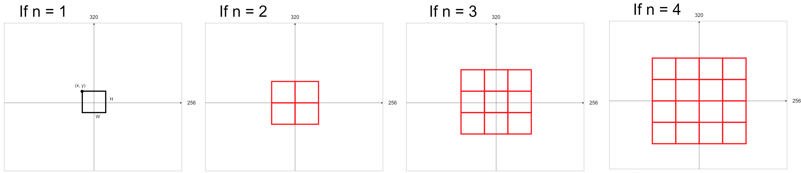
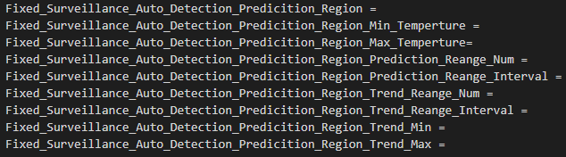
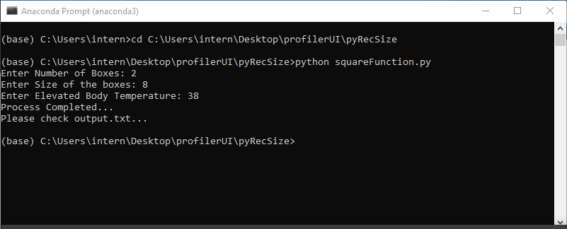
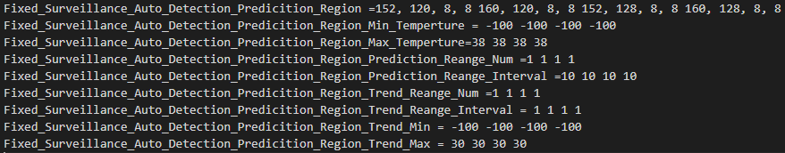

# pyRecSize

**Aim:** 

A function that takes input n (# of boxes) and size (size of the square) and elevation body temperature (ebt) and return the Xn, Yn, Wn, Hn and and write them to a text file.

**Installation Steps:**

**Step 1:** Download anaconda (**Python 3.7 version**) on: https://www.anaconda.com/distribution/#windows 

**Steps 2:** Open Anaconda Prompt (anaconda3)

**Step 3:** Type in the Prompt: git clone https://github.com/samiarja/pyRecSize.git

**Step 4:** cd pyRecSize

**Step 5:** python pyRecSize.py

**Step 6:** Enter Number of Boxes, Size of the boxes and Elevated Body Temperature

**Step 7:** Open output.txt

Done!

**Example:**

Text file before running the script:

Text file after running the script:

